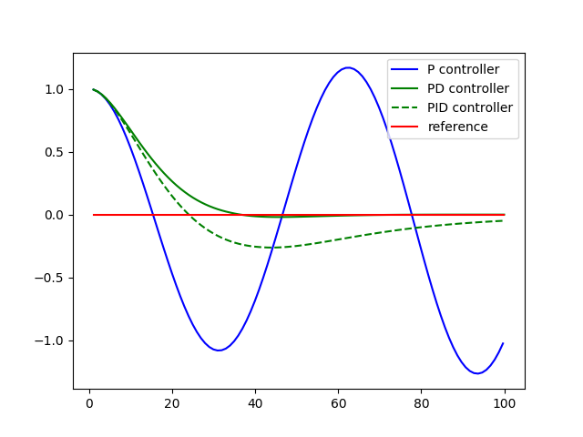

# PID_Cman
## Submission for Term2 Project 4: PID Controller

Objective: Implementing a PID controller algorithm in C++ to solve a steering angle problem from a simulator of a car driving on a predefined circle track (reference trajectory).

Environment setup and boilerplate code provided by Udacity under https://github.com/udacity/CarND-PID-Control-Project.

> Improvements made to:

- src/main.cpp
- src/PID.cpp

> Basic algorithm

In main.cpp the PID controller is initialized with a set of 3 params (Kp, Ki, Kd) calling the __Init()__ function of the pid instance. The parameters scale effects of the Cross Track Error (__CTE__) to determine the new steering value. This value equals the total error calculated in function __TotalError()__ that the algorithm is trying to minimize. In case the steer value is violating the vehcile spec it is limited to the min/max steering ability (-1 to 1) of the vehicle. PID.cpp implements the __UpdateError()__ function with the proportional, integral and differential errors.

> Effects of the hyperparameter

__Speed throttle__ set to 0.3. The parameters __(Kd, Ki, Kd)__ where determined manually starting with a proportional term (1,0,0), where the car went off track immediatly. Reducing to (0.1,0,0) decreased the amplitude of the steer angle significantly and as expected, but the car remained oszillating and running off track soon. Introducing a differential term (0.1,0,1) helped to reduce the oszillation and the car completed the track successfully. Increasing the speed throttle to 0.6 resulted in stronger oszillation mitigated with a higher differential term (0.1,0,1.4). To mitigate any biases a small integral term (0.1,0.005,1.4) lead to some overshooting in curves but didnt improve the overall driving behavior, thus dropped back to 0. Expected effects can be visulized conceptually, see "PID".

> PID

> Finding the hyperparameter

Further "try and observe" in incremental steps led to the final paramters __(0.095,0,1.35)__ at speed throttle __0.55__. Another way of determining the parameters more "sofisticatedly" is to implement a __Coordinate Ascent__ algorithm that converges fast but overshoots initially and needs to be tuned too, see "TWIDDLE".

> TWIDDLE

Passing the project requires a successful simulator track run and documentation, pls see project rubric https://review.udacity.com/#!/rubrics/824/view.

This project involves the Term 2 Simulator which can be downloaded here: https://github.com/udacity/self-driving-car-sim/releases. A server package uWebSocketIO is setting up a connection from the C++ program to the simulator, which acts as the host.

## Running the project
> Basic Build Instructions: run shell-commands from the project directory
1. Clone this repo.
2. Make a build directory: `mkdir build && cd build`
3. Compile: `cmake .. && make`
4. Run it: `./pid`. 
5. Run and start the simulator (resolution: 600x800, Mode: fastest)

## Results
> Vehicle stays on track for multiple rounds with top speed of 60mph. 

For this speed, in certain situations the car is oszillating, but staying in the limits of the road. Supposedly, for a regular passenger this would not be acceptable, but could eg. improved by 

- drive slower, eg 30mph
- implementing a throttle PID controller that reduces speed for curves and accelerates again accordingly
